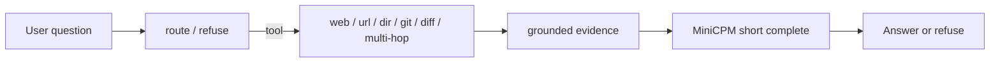

# deku

[日本語](./README.ja.md)

A **MiniCPM5-1B–oriented** local task harness: small factual jobs (web facts, URL
summaries, repo lookup, git/diff, weak multi-step plans) with **explicit
refusals** when the request is out of scope. The model only does short grounded
completions; planning and tool choice live in code.

> **Status:** Phase 2 agent core is in-tree (`deku ask`, route / refuse / tools).
> Measure capability smokes on the default GGUF path; do not copy MLX scores from
> .

## Design in one page

| Layer | Responsibility |
| --- | --- |
| **Agent / harness** | Route, refuse, tools, weak multi-hop / orchestrate, integrate answers |
| **LLM client** | OpenAI-compatible HTTP (`/v1/chat/completions`) only |
| **Default serve** | Official **GGUF** + `llama-server` (see below) |

The harness **does not care** how the HTTP API is implemented (llama.cpp, oMLX,
deku-serve, …). Semantics are tuned for **MiniCPM5-1B** (English-first,
no free-form long reasoning, no code authoring).

### Default backend (GGUF)

- Weights: [`openbmb/MiniCPM5-1B-GGUF`](https://huggingface.co/openbmb/MiniCPM5-1B-GGUF)
- Recommended quant: **`MiniCPM5-1B-Q4_K_M.gguf`** (~657 MB)
- Server: vanilla [`llama.cpp`](https://github.com/ggerganov/llama.cpp) `llama-server`
  with `--jinja` (matches [OpenBMB’s llama.cpp cookbook](https://github.com/OpenBMB/MiniCPM/blob/main/docs/deployment/llama_cpp.md))

Any other OpenAI-compatible MiniCPM5-1B endpoint can be selected via env vars;
MLX is an optional alternate path for Apple Silicon developers, not the product
default.

## Quick start

Requires [mise](https://mise.jdx.dev/) (pins Python + [uv](https://docs.astral.sh/uv/)) and
`llama-server` on PATH. Weights download once on first serve (~657 MB).

```bash
# 1) Toolchain
curl https://mise.run | sh    # or: brew install mise
mise trust && mise install    # python 3.12 + uv from mise.toml

# 2) Package
mise run sync                 # uv sync → .venv + editable install
mise run doctor               # optional sanity check

# 3) llama-server (not vendored in git)
brew install llama.cpp        # macOS bottle; or build https://github.com/ggerganov/llama.cpp

# 4) Serve MiniCPM5-1B GGUF (downloads Q4_K_M into ~/.cache/deku/models)
mise run serve
```

Ask (with server up for live MiniCPM answers; refuse / some lexical paths work offline):

```bash
uv run deku ask "What is 2+2?"
uv run deku ask "Who is the CEO of Apple?"
uv run deku ask "What is the last commit message?" --root .
uv run deku ask "What is the PREFILL string?" --root . --no-live
```

Smoke (second terminal, with the server up):

```bash
mise run smoke
# or:
curl -s http://127.0.0.1:8080/v1/chat/completions \
  -H 'Content-Type: application/json' \
  -d '{"model":"MiniCPM5-1B","messages":[{"role":"user","content":"Say hi in one word."}],"max_tokens":16,"chat_template_kwargs":{"enable_thinking":false}}'
```

Without mise, the same path works with uv alone:

```bash
uv sync
uv run deku-serve
uv run python -m unittest discover -s tests
```

| Env | Role | Default |
| --- | --- | --- |
| `DEKU_URL` | API base (no `/v1`) | `http://127.0.0.1:8080` |
| `DEKU_MODEL` | Model id sent to the server | `MiniCPM5-1B` |
| `DEKU_API_KEY` | Optional bearer | empty |
| `DEKU_MODEL_DIR` | GGUF cache directory | `~/.cache/deku/models` |
| `DEKU_HOST` / `DEKU_PORT` | Bind address for `deku-serve` | `127.0.0.1` / `8080` |

| Task | What it does |
| --- | --- |
| `mise run sync` | `uv sync` (lockfile + editable `deku`) |
| `mise run test` | unit tests (no GPU / no weights) |
| `mise run doctor` | PATH / Python / GGUF readiness |
| `mise run capability-smoke` | Live GGUF smokes (refuse / web / url / hop / git / dir) |
| `mise run serve` | ensure GGUF → `llama-server --jinja` |
| `mise run smoke` | one `llm.complete()` against `DEKU_URL` |

Tests (no model required):

```bash
mise run test
```

Live capability smokes (needs `mise run serve` + network):

```bash
mise run capability-smoke
# writes evals/results/capability_smoke.json
```

## How it works



The harness picks tools and builds evidence; MiniCPM only compresses or extracts short grounded spans. It does not author multi-step plans.

## Limitations (honest)

- Tuned for **MiniCPM5-1B** on **English** (and Chinese to some extent). Japanese often loops — not supported.
- No general coding agent; code authoring and math are **refused** with a reason.
- Default extract path uses **chat completions** (GGUF + `llama-server --jinja`). Prefill `/v1/completions` degenerates on this stack — measured.
- Live web / URL quality depends on search snippets and network; weak evidence abstains rather than inventing.
- Capability claims must be re-measured on GGUF (`mise run capability-smoke`); do not copy MLX scores from prior experiments.

## Intended capabilities (target)

- Public short facts (`web_search`)
- Summarize a given URL or local README (`url_read` / `dir_search` + hierarchical summary)
- Repo constants / overview (`dir_search`)
- Last commit / blame-style questions (`git_search`); staged/unstaged diffs (`diff_search`)
- Weak multi-step: rule-built plans, optional pronoun bind across hops, numbered or paragraph integrate
- **Refuse with a reason**: math, code authoring, chitchat, open-ended essays / proofs

## Non-goals

- General coding agent / SWE-bench runner
- Model-authored multi-step “chain of thought” planning
- Japanese as a supported input language (MiniCPM5-1B is EN/ZH; JA loops)
- Bundling MLX conversion stacks or large eval matrices from prior experiments

## Planned layout

```
deku/           # Python package: llm client (+ route/tools later), serve helpers
bin/deku-serve  # thin wrapper: ensure GGUF → llama-server --jinja
bin/deku        # CLI: ask / dispatch (Phase 2)
tests/          # unittest
docs/           # architecture, roadmap, decisions
evals/          # small fixed demo smokes only (not a research warehouse)
mise.toml       # python / uv pins + tasks (sync, test, serve, doctor)
uv.lock         # reproducible installs
```

## Docs

| Doc | Purpose |
| --- | --- |
| [docs/architecture.md](./docs/architecture.md) | Boundaries, HTTP contract, GGUF default |
| [docs/roadmap.md](./docs/roadmap.md) | Phased build plan (0→4) |
| [docs/decisions/0001-gguf-default-serve.md](./docs/decisions/0001-gguf-default-serve.md) | Why GGUF + llama-server |


## License

Apache-2.0. See `LICENSE`. MiniCPM5 model weights are under their own licenses on Hugging Face.
